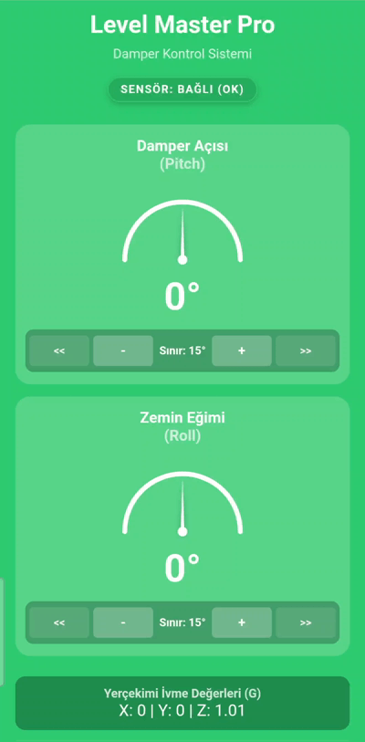
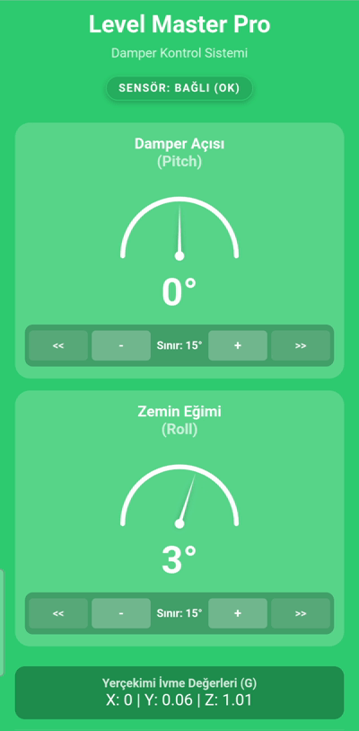
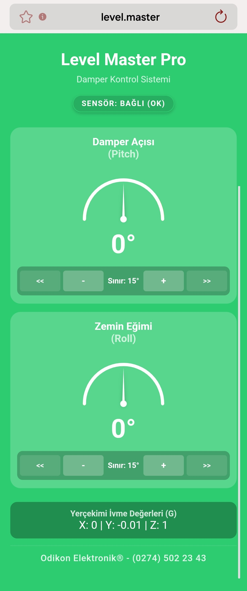
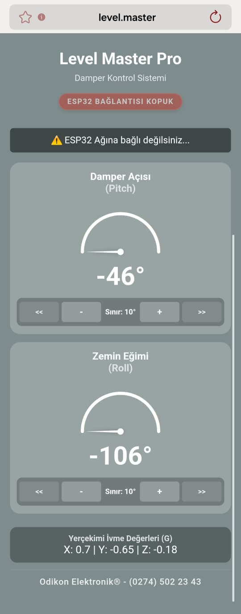
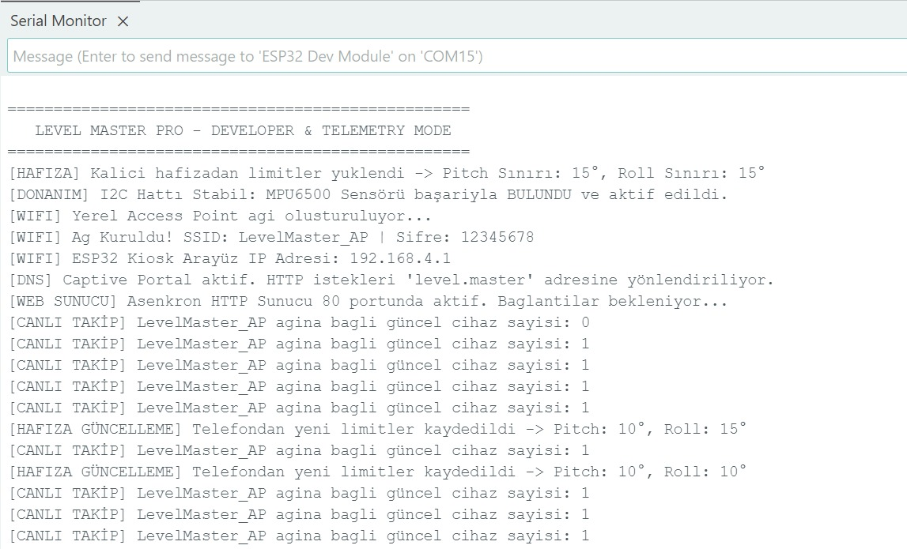

# Level Master Pro 🚛   Eğim ve Güvenlik Otomasyon Sistemi / Tilt & Safety Automation System

  <a href="#-türkçe-dokümantasyon">🇹🇷 Türkçe Dokümantasyon</a> | 
  <a href="#-english-documentation">🇺🇸 English Documentation</a>

---

## 🇹🇷 Türkçe Dokümantasyon

**Level Master Pro**, endüstriyel damperli araçlar ve tır lojistiği için geliştirilmiş, ESP32 mimarisi ve MPU6500 6-eksenli ivmeölçer/jiroskop tabanlı kapalı devre bir **kablosuz telemetri ve güvenlik sistemidir**. 

Bu proje; donanım entegrasyonu, gömülü yazılım sinyal işleme algoritmaları ve modern web teknolojilerini bir araya getiren uçtan uca (end-to-end) endüstriyel bir Nesnelerin İnterneti (IoT) çözümüdür.

> 🔒 **Fikri Mülkiyet Bilgilendirmesi:** Bu proje ticari bir ürün olarak geliştirildiğinden, cihaz firmware kodları (C++) ve web arayüzü kaynak kodları (HTML5, CSS3, JavaScript, SVG) kamuya kapalıdır. Bu depoda projenin mimarisi, mühendislik yaklaşımları ve telemetri çıktıları belgelenmiştir.

### 📺 Canlı Ürün Demosu (Geliştirici Sürümü)
Sistemin şantiye sarsıntılarını sönümleme kararlılığı ve kritik limit aşımında sürücüyü uyaran anlık renk geçiş mimarisi:

### 🛠️ Teknolojik Altyapı (Tech Stack)
* **Mikrodenetleyici & Ağ Güvenliği:** ESP32 MCU, Asynchronous Web Server, Asenkron Lokal Wi-Fi Access Point (AP Mimarisi), DNS Captive Portal Server (Ağ Yönlendirme).
* **Donanım Mimarisi & Haberleşme:** MPU6500 6-Axis IMU (İvmeölçer), I2C Veri İletişim Protokolü, Donanımsal Kalıcı Hafıza Yönetimi (NVS - Non-Volatile Storage / Preferences Kütüphanesi).
* **Mühendislik & Veri Yönetimi:** RESTful Veri API Tasarımı, Dinamik JSON Serileştirme (Serialization/Parsing), Gömülü Yazılım Sinyal İşleme (Gürültü Filtreleme).
* **Ön Yüz (UI/UX):** Vanilla JavaScript (Asenkron Fetch API / AJAX), SVG Grafik Matematiksel Haritalama & İğne Rotasyon Algoritması, CSS3 Grid & Flexbox, Cross-Browser Mobile Engine Optimization (Chrome & Samsung Internet).

### 🧠 Öne Çıkan Mühendislik Çözümleri
1. **Yazılımsal Sinyal Sönümleme (Moving Average Filter):** Tır motorunun yüksek rölanti titreşimleri ve şantiye sarsıntıları, sensörden gelen ham verilerde gürültülere yol açar. Bunu engellemek için gömülü yazılım tarafında **10 elemanlı Hareketli Ortalama Filtresi** kurulmuştur. Sistem her 250ms'de bir güncel 10 ölçümün ortalamasını alarak stabil bir veri akışı sunar.
2. **Akıllı Güvenlik ve Dinamik Eşik Yönetimi:** Sürücü, kabin içindeki dijital paneli kullanarak limitleri anlık güncelleyebilir. Belirlenen bu limitler ESP32'nin flash hafızasına kalıcı olarak işlenir.
   
   
   
3. **Sıfır Yapılandırma Ağ Yönetimi (Captive Portal):** İnternete ihtiyaç duymadan lokal bir Access Point ağı yayınlar. DNS sunucusu sayesinde tarayıcıya girilen herhangi bir adres otomatik olarak cihazın arayüzüne yönlendirilir.

### 📱 Arayüz Durum Yönetimi (UI State Management)
| Sistem Durumu: Kararlı / Güvenli Operasyon | Ağ Bağlantısı Kesildiğinde (Hata Yakalama) |
|:---:|:---:|
|  |  |

### 🎛️ Donanım ve Başlatma Logları (Serial Monitor)

---

## 🇺🇸 English Documentation

**Level Master Pro** is a closed-loop **wireless telemetry and safety system** developed for industrial dump trucks and heavy-duty logistics, powered by the ESP32 architecture and MPU6500 6-axis accelerometer/gyroscope.

This project stands out as an industrial IoT masterpiece that merges hardware integration, embedded signal processing algorithms, and responsive modern web technologies.

> 🔒 **Intellectual Property Notice:** Since this project was developed as a commercial product, the source codes (C++ / HTML5) are kept private. This repository serves as documentation for the system architecture, engineering methodologies, and telemetry outputs.

### 📺 Live Product Demo (Developer Edition)
Demonstration of signal stabilization against site vibrations and the real-time color-coded warning system when critical limits are breached:

### 🛠️ Tech Stack
* **Microcontroller & Networking:** ESP32 (Asynchronous Web Server, WiFi Access Point, DNS Captive Portal Server).
* **Hardware & Communication:** MPU6500 Accelerometer, I2C Protocol, Non-Volatile Memory Management (Preferences/EEPROM).
* **Frontend (UI/UX):** Vanilla JavaScript (AJAX/Fetch API, JSON Parsing), SVG Graphical Math Mapping, CSS Grid & Flexbox, Cross-Browser Mobile Engine Optimization.

### 🧠 Core Engineering Solutions
1. **Software Signal Smoothing (Moving Average Filter):** High-frequency vibrations from heavy machinery corrupt raw sensor data. To prevent visual flickering on the driver's screen, a **20-element Moving Average Filter** was implemented in the firmware, serving an analog-like smooth data flow.
2. **Smart Safety & Dynamic Threshold Management:** Drivers can instantly update Pitch and Roll thresholds via the digital panel. These limits are stored permanently inside the ESP32's flash memory.
   
   
   
3. **Zero-Configuration Network (Captive Portal):** Broadcasts a local Access Point network without requiring internet. Built-in **DNS Hijacking** intercepts any browser request and redirects the user directly to the device interface.

### 📱 UI State Management
| System Status: Stable / Safe Operation | Connection Lost (Error Handling) |
|:---:|:---:|
|  |  |

### 🎛️ Hardware Initialize & Telemetry Logs (Serial Monitor)

---

## 📈 Sürüm ve Üretim / Production Info
* **Geliştirici Sürümü / Developer Ed. (v2.1):** Active telemetry panel for raw X, Y, Z G-Force visualization.
* **Endüstriyel Üretim / Industrial Ed. (v2.2):** Clean, distraction-free interface optimized for fleet operations.

**Geliştirici / Developer:** Computer Engineering Graduate  
**Kurumsal Altyapı / Corporate Infrastructure:** Odikon Elektronik&reg;
